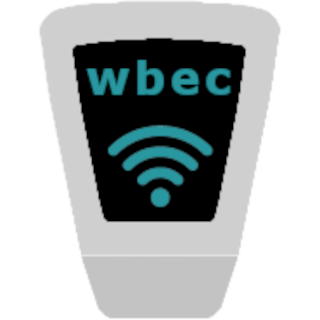

# ioBroker.wbec

[](https://www.npmjs.com/package/iobroker.wbec)
[](https://www.npmjs.com/package/iobroker.wbec)


[](https://nodei.co/npm/iobroker.wbec/)

**Tests:** 

## wbec adapter for ioBroker

Integration of Heidelberg WallBox Energy Control ESP8266

## Description

The **ioBroker WBEC Adapter** allows you to regularly monitor and control the state of your WBEC Controller. This adapter provides the capability to query the controller at a configurable interval and to interact with certain important states. For example, you can monitor charging power and directly adjust the configuration for PV surplus charging.

## Features

- **Regular Queries**: The adapter queries the state of the WBEC Controller at an interval you specify, ensuring that you always have up-to-date information on its status.
- **Writable States**: You can directly adjust certain parameters, such as charging power and the configuration for PV surplus charging, through the ioBroker interface.

## Manufacturer Information

The WBEC Controller is developed by Stefan Ferstl [steff393](https://github.com/steff393/wbec). Many thanks for providing this excellent controller and for the support!

For more information and technical details, please visit the [Manufacturer’s website](https://steff393.github.io/wbec-site/).

## Messages

### setCurrent
Sets the current limit for a charging box directly without modifying adapter states.

**Parameters:**
- `id`: Box ID (0-15)
- `currLim`: Current limit in ampere

**Example:**
```javascript 
// Set charging current to 16A for box 0 
sendTo('wbec.0', 'setCurrLim', { id: 0, currLim: 16 });
```

### setPowerTarget
Sets the current limit depending on phases and voltage to match the target power.

**Parameters:**
- `id`: Box ID (0-15)
- `powerTarget`: Power in watt

**Example:**
```javascript 
// Set charging power to 3600W for box 0 
sendTo('wbec.0', 'setPowerTarget', { id: 0, powerTarget: 3600 });
```

## Open Tasks
* Try to reset wbec client on error

## Changelog
<!--
    Placeholder for the next version (at the beginning of the line):
    ### **WORK IN PROGRESS**
-->
### 0.4.0 (2025-05-22)
* [REFACTOR] Fix various issues reported from adapter checker
* [FEATURE] Assert all timers are reset onUnload adapter

### 0.3.1 (2025-05-22)
* [BUGFIX] Assert set current values are in valid range between 6..16 or 0

### 0.3.0 (2025-05-21)
* [FEATURE] Add debug logging for every request
* [FEATURE] Filter onStateChange events to avoid handling on unchanged values
* [FEATURE] Add message handler to receive `setPowerTarget` messages
* [FEATURE] Add `phasesAvailable` state that remains at last used phases
* [FEATURE] Add `setCurrent` message handler to allow setting currLim for box without modifying states.

### 0.2.0 (2025-05-15)
* [REFACTOR] Replace internal wbec client by separate library https://www.npmjs.com/package/wbec-client
* [FEATURE] New maxRequestInterval parameter asserts that wbec is not flooded with requests
* [BUGFIX] charge logs only get requested if enabled on wbec config

### 0.1.4 (2025-04-24)
* [BUGFIX] Slow down initial requests to avoid wbec overload on adapter start

### 0.1.3 (2024-11-30)
* [BUGFIX] Allow configurable Timeout for requests

### 0.1.2 (2024-09-19)
* [TASK] Add admin link to wbec

### 0.1.1 (2024-09-17)
* [TASK] Add error handling on external requests
* [TASK] Update dependencies from dependabot

### 0.1.0 (2024-09-08)
* [TASK] initial release

## License

[Licensed under GPLv3](LICENSE) Copyright (c) 2025 jb-io
